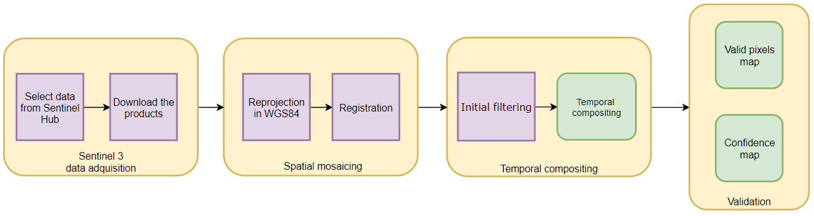

Ibañez, D., Fernandez-Beltran, R., Sotoca, J. M., Mollineda, R. A., Moreno, J., & Pla, F. (2020). Multitemporal Mosaicing for Sentinel-3/FLEX Derived Level-2 Product Composites. IEEE Journal of Selected Topics in Applied Earth Observations and Remote Sensing, 13, 5439-5454.

# Multitemporal Mosaicing for Sentinel-3/FLEX Derived Level-2 Product Composites

[Damian Ibañez], [Ruben Fernandez-Beltran](https://scholar.google.es/citations?user=pdzJmcQAAAAJ&hl=es), [Jose Martinez Sotoca], [Ramon A Mollineda], [José Moreno], [Filiberto Pla]
---

This repo contains the codes for the JSTARS paper: [Multitemporal Mosaicing for Sentinel-3/FLEX Derived Level-2 Product Composites](https://ieeexplore.ieee.org/abstract/document/9195119). The increasing availability of remote sensing data raises important challenges in terms of operational data provision and spatial coverage for conducting global studies and analyses. In this regard, existing multitemporal mosaicing techniques are generally limited to producing spectral image composites without considering the particular features of higher-level biophysical and other derived products, such as those provided by the Sentinel-3 (S3) and Fluorescence Explorer (FLEX) tandem missions. To relieve these limitations, this article proposes a novel multitemporal mosaicing algorithm specially designed for operational S3-derived products and also studies its applicability within the FLEX mission context. Specifically, we design a new operational methodology to automatically produce multitemporal mosaics from derived S3/FLEX products with the objective of facilitating the automatic processing of high-level data products, where weekly, monthly, seasonal, or annual biophysical mosaics can be generated by means of four processes proposed in this work: 1) operational data acquisition; 2) spatial mosaicing and rearrangement; 3) temporal compositing; and 4) confidence measures. The experimental part of the work tests the consistency of the proposed framework over different S3 product collections while showing its advantages with respect to other standard mosaicing alternatives. The source codes of this work will be made available for reproducible research.





## Usage

`./codes/STC.m` is the proposed temporal compositing algorithm.

`./codes/temporal_MULTI.m` is a sample of the main script.


## Citation

```
@article{ibanez2020multitemporal,
  title={Multitemporal Mosaicing for Sentinel-3/FLEX Derived Level-2 Product Composites},
  author={Iba{\~n}ez, Damian and Fernandez-Beltran, Ruben and Sotoca, Jos{\'e} Mart{\'\i}nez and Mollineda, Ram{\'o}n A and Moreno, Jos{\'e} and Pla, Filiberto},
  journal={IEEE Journal of Selected Topics in Applied Earth Observations and Remote Sensing},
  volume={13},
  pages={5439--5454},
  year={2020},
  publisher={IEEE}
}
```

## References

[1] D. P. Roy, J. Ju, K. Kline, P. L. Scaramuzza, V. Kovalskyy, M. Hansen, T. R. Loveland, E. Vermote, and C. Zhang, “Web-enabled Landsat Data (WELD): Landsat ETM+ composited mosaics of the conterminous United States,” Remote Sens. Environ., vol. 114, no. 1, pp. 35–49, 2010.
